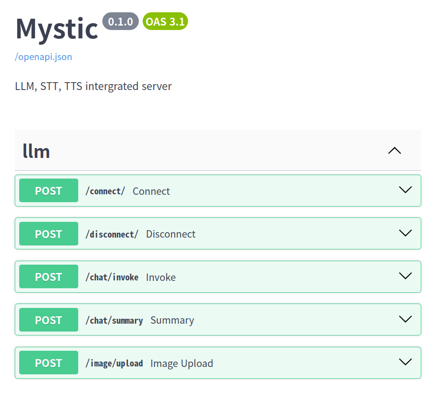

This is the official repository of capstone design project 2024 of kookmin univ. 

# Mystic

## Abstract
With the recent interest in diary-keeping, the capstone project team '아니 근데 오늘 진짜' has implemented a model that uses LLM to automatically generate a diary through conversations about the events of the day. Mystic is a project that uses STT and TTS technology to talk to LLM to generate a diary. 

This repository contains the AI part of the project '아니 근데 오늘 진짜'. ([To go to the main project README, click here.](https://github.com/kookmin-sw/capstone-2024-13))

This repository includes STT, TTS, LLM Prompt Engineering, LLM Fine-tuning, and Image Captioning.

## Index
 - [Features](#features)
 - [Installation](#installation)
 - [Getting Started](#getting-started)
 - [Example](#example)
 
## Features
 **[Speech-to-Text](https://github.com/kookmin-sw/capstone-2024-13/tree/main/src/service/mystic/src/model/stt)** : Converts the user's voice to text and passes it to LLM as input.

 **[Text-to-Speech(Voice Cloning))](https://github.com/kookmin-sw/capstone-2024-13/tree/main/src/service/mystic/src/model/tts)** : Listen to your journal entries with text-to-speech technology.

 **[Interactive Conversations](https://github.com/kookmin-sw/capstone-2024-13/tree/main/src/service/mystic/src/chain)** : Engage in a natural conversation with your journal for a more immersive experience.

 **LLM Fine-tuning**: Enhance the conversational and summarization abilities of the LLM through fine-tuning.
 - [Phi-2 Fine-tuning]()
 - [EEVE Fine-tuning](https://github.com/kookmin-sw/capstone-2024-13/tree/main/src/service/mystic/src/model/llm/eeve)

 **[LLM Prompt Engineering](https://github.com/kookmin-sw/capstone-2024-13/tree/main/src/service/mystic/src/template)**: Create a chatbot character using prompt engineering and reflect the desired personality in the character.

 ## Installation
 To install the packages required to run this project, please use the following command. It is recommended to set up and install within a virtual environment.
 ~~~
poetry install
 ~~~

 To download the image captioning model, run the following command from the root of the project.
 ~~~
 cd src/model
~~~
~~~
 git lfs install
~~~

~~~
 git clone https://huggingface.co/nlpconnect/vit-gpt2-image-captioning
 ~~~

 For more details on image captioning, please refer to the [Link](https://huggingface.co/nlpconnect/vit-gpt2-image-captioning).

 ## Getting Started
 The `src/app/server.py` code is the entry point for running the Mystic server. The following command is used to run the Mystic server. You can test if the API is working properly by accessing `localhost:8000/docs`.
 ~~~
 uvicorn src.app.server:app --host 0.0.0.0 --port 8000 --reload
 ~~~

 ## Example
  