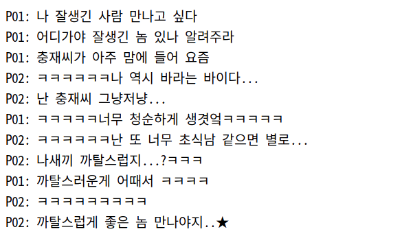
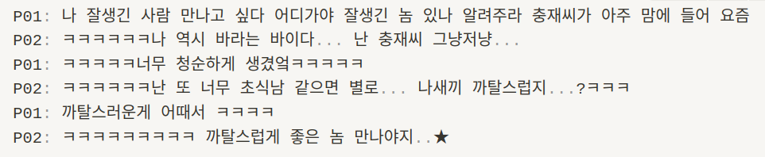
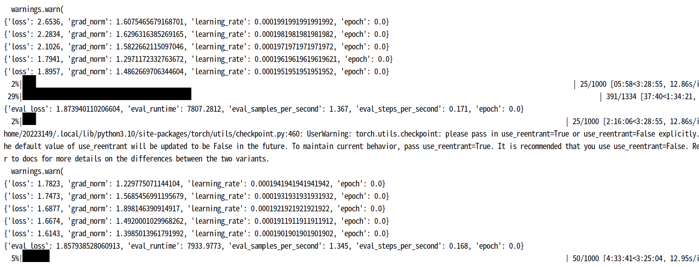
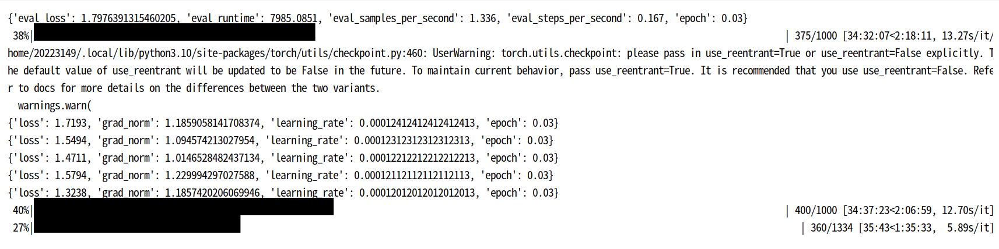

# EEVE Model Fine-tuning

## Abstact
### 프로젝트 "아니 근데 오늘 진짜"는 LLM 기반 챗봇과의 대화를 통한 일기 생성 서비스이다. 대화를 기반으로 일기를 작성하는데 일기 작성 또한 LLM을 사용한다. 언어 모델의 downstream task인 요약 task를 다시 downstream task로 사용하는 "대화를 일기로 요약" task를 위해 open-source model을 fine-tuning을 진행하였다.

## Used Model
### 사용한 모델은 Yanolja에서 개발한 EEVE mdoel을 사용하였다. EEVE model은 SOLAR와 Phi-2를 기반으로 만들어졌으며, 프로젝트에서는 SOLAR를 기반으로 만들어진 EEVE model을 사용하였다. EEVE는 비영어 언어의 모델을 사용할 때 많은 토큰 사용으로 인한 단점을 해결하기 위한 모델이다. 효율적인 언어 확장 방식을 제안했으며, 한국어 능력에서 높은 성능을 보여준다.
### [EEVE Model](https://huggingface.co/yanolja/EEVE-Korean-Instruct-10.8B-v1.0)

## Dataset
### 데이터셋은 AI Hub의 [한국어 대화 요약 데이터셋](https://www.aihub.or.kr/aihubdata/data/view.do?currMenu=&topMenu=&aihubDataSe=data&dataSetSn=117)을 사용하였다. 71139개의 데이터를 사용하였고, 70%를 train, 15%를 test, 15%를 validation에 사용하였다. 또한 데이터셋 전처리를 진행하였다. 한 번의 사용자의 말이 끝나면 다음 사용자의 말이 시작하도록 변경하였다.

### 전처리 전
  

### 전처리 후

## Fine-tuning
### EEVE Model의 Fine-tuning 방식은 QLoRA 방식을 사용하였다.
QLoRA는 Quantization 과 LoRA 기술을 통합하여 대규모 언어 모델의 효율성과 성능을 동시에 개선하는 방법론이다. 언어 모델의 학습 파라미터 수를 현저히 줄이면서도 모델의 성능을 유지하거나 개선하는 것을 목표로 한다. QLoRA 는 모델의 파라미터를 효율적으로 양자화하고, 저랭크 행렬 분해를 적용함으로써, 리소스가 제한된 환경에서도 고성능의 NLP 모델을 활용할 수 있다.

### Hyper Parameter
|분류|내용|
|-|-|
max_steps|1000
learning_rate|2e-4
per_device_train_barcn_size|1

### Loss
  

### Result
~~~
dialog
AI: 이 사진 속 강아지는 어떤 종류인가요? 
Human: 이 강아지는 저희 집 강아지 뚱이에요. 정말 귀엽지 않나요? 종류는 말티즈입니다. 
AI: 뚱이라는 이름이 참 귀엽네요! 말티즈는 정말 사랑스러운 종류이죠. 이 사진을 찍을 때 뚱이가 편안한 모습으로 누워 있었나요? Human: 네. 오늘 신나게 산책하고 피곤해서 코 골면서 자고있는 거에요. 
AI: 피곤한 모습이 참 귀엽네요! 산책을 하고 나서 피곤해서 깊이 자는 뚱이의 모습이 정말 안정적으로 보여요. 뚱이는 산책을 즐기나요? 
Human: 네 산책을 즐기지만 많이 걷는 건 또 싫어해요. 
AI: 뚱이가 산책을 즐기는 모습을 상상하니 더 귀엽네요! 뚱이가 행복해하는 모습을 상상하며 행복한 기분이 드는군요. 그럼, 뚱이는 풀 냄새를 맡는 것 외에 또 어떤 것을 좋아하는지 궁금하네요.

summary
산책을 즐기는 뚱이의
~~~

## Analisys
### loss는 2.6대에서 시작하여 1.3대까지 떨어지고 이후로 떨어지지 않고 1점대를 유지했습니다. validation loss는 크게 떨어지지 않았습니다. 원하는 결과가 나오지 않았고 그 원인으로 데이터셋의 질이 낮았다고 생각한다. 연구에서 사용한 데이터셋은 요약 테스크로 일기의 형태는 아니다. prompt로 데이터셋의 한계를 보완해보기 위해 작업했지만 부족하다는 것을 느꼈다.
