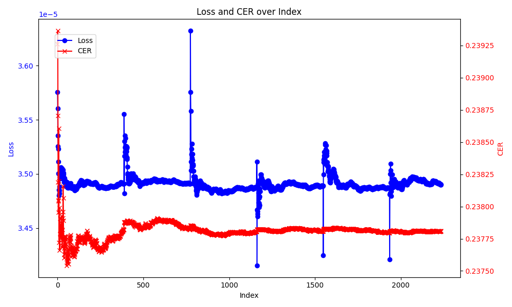
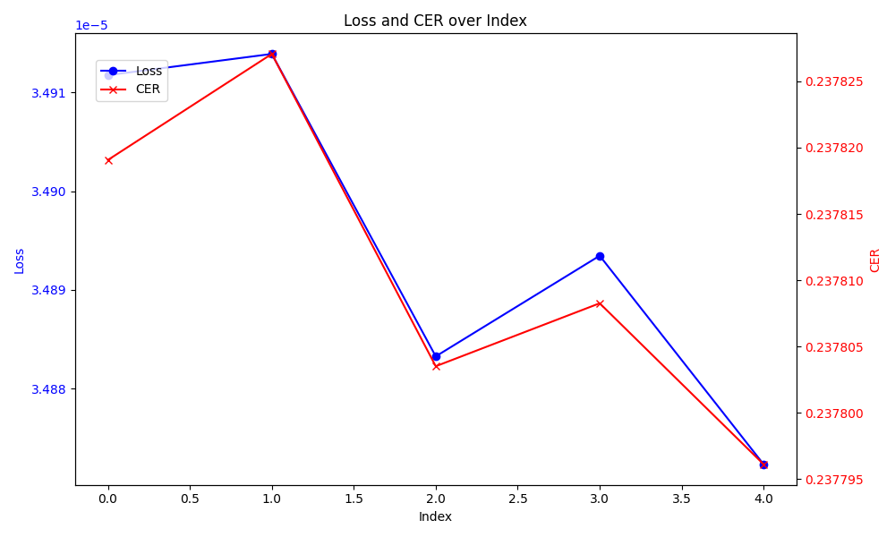
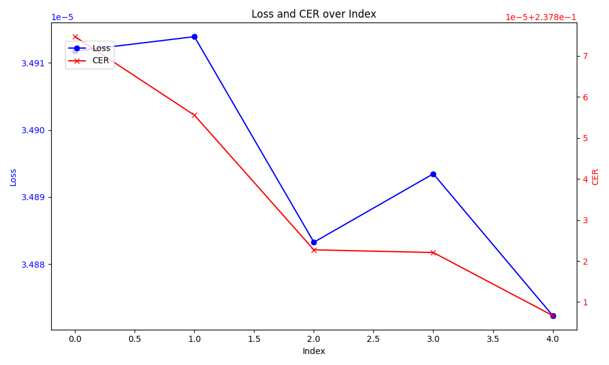

# Text-to-Speech & Voice Clonning

## Table of Contents
 ### [Abstract](#abstract)
 ### [Used Model](#used-model)
 ### [Trial](#trial)
 ### [Dataset](#dataset)
 ### [Training](#training)
 ### [Analysis](#analisys)
 ### [Example](#example)
 ### [Reference](#reference)

## Abstract
### 2024 캡스톤 디자인 프로젝트 팀 '아니 근데 오늘 진짜'는 사용자와 Large-Language-Model(이하 LLM)간의 음성대화를 통해 하루의 일기를 작성하는 서비스를 구현한다. 이를 위해 LLM에 사용자의 발화를 입력하기 위한 음성 인식기술이 필요하다. 이를 위해 Speech-to-Text 기능을 구현하였다.

## Used Model
### 현재 사용중인 모델은 [Whisper]()이다. 이 모델은 OpenAI에서 개발한 최신 음성인식 모델이다. 다국어 입출력을 지원하며, 대규모 데이터셋을 통해 학습되었기 때문에 억양이나 소음에 강건한 정확도를 보인다. 또한 이 모델은 오픈소스이기 때문에 프로젝트에 사용하기 적합하다고 판단하였음.

## Trial
### Whisper를 사용하기 전, [Baidu Research]()에서 개발한 음성인식 시스템인 [Deep Speech 2]()를 사용하기 위해 한국어로 fine-tuning을 진행하였음. Deep Speech 2 모델은 End-to-End학습을 지원하며 높은 성능을 보인 프로젝트가 많았기 때문에 선택하였다.

## Dataset
### 데이터셋은 AI Hub의 '한국어 음성'데이터셋을 이용한다. 이 데이터셋을 Deep Speech 2에 학습시키기 위해서는 철자전사를 선택하였으며, '.(마침표)', ',(쉼표)'는 음성신호로부터 인식하기 어려우며 크게 중요하지 않다고 판단하여 제외하였다.

### 또한 Deep Speech 2 모델은 학습하기 위해 한국어 Vocab을 제작하여야하기 때문에 모든 한글의 조합과 특수기호를 숫자로 변환하여 csv파일에 저장한다.

## Training
### Environment
|분류|사양|
|-|-|
|CPU|Ryzen 7700x|
|GPU|Geforce RTX 3090|
|Memory|32 GB|

## Train Result
### Loss and CER per training step

### Loss and CER per training Epoch

### Evaluation Loss and CER

## Example
| Target | Prediction |
|-|-|
|넣어보고 되면 하는 거고 안 되면 그냥 알바를 하던가 하면서 같이 공부를 해야 될 거 같애. 일단은 안데 너무 공부만 맨날 하니까 하루 종일 독서실 앉아있으면 너무 힘들어가지구|넣어보고 되면 하는 거고 안 되면 그냥 알바를 하든 하하면서 같이 공부를 해해야야야 될 거 같애. 일단단은 근데 너무 공부만 맨날 하니까 하루종 독서실 앉아 있있으면면 너무무 힘들어가지고|
|너네가 너무 이상하다는 거야. 그 영화는 슬픈 슬픈 장면이 없다는 거야. 이 말이 이해가 돼? 나는 진짜 공감이 안 돼. 나는 정말 우리 그때 거기서 엄청 울었잖아. 나는 거기서 울었거든 그 |너네가 너무무 이상하다는 거야야. 그 영화는 슬픈 슬픈 장면이 없없다는 거야야야. 이 이 말이 이해가 돼. 나는 진짜 공감이 안 돼. 나는 정말말 우리 그때 거기서 엄엄청 울었잖잖아. 나는 거기서 울었거든 그|
|어 나는 지금 멘탈이 그렇기 때문에 조직 생활이 그게 겁나요. 뭐 텃세라는 것도 있고 뭐 사람 저거 하니까 거기서 오는 스트레스가 있고|어 나는 지금 멘탈이 그렇기 때문에 조식생활디 그게 겁나요. 뭐 텃세하는 것도 있있고 뭐 사람저라고 하니까 거기기서 마스 될수가 있있고|
|그니까 뭐 뭣만 있으면은 보면은 그거를 이용해서 거기서 이제 뭐 뭐 이케 판매를 한다거나 이래가지고 대박치는 사람들이 꼭 있더라고 보면.|그냥 뭐 뭐만 있으으면은 보면은 그그거를 이용해서 거기서 이제 뭐 뭐 게 판매를 한한다거나 이래가지고 대박 치는 사람람들들 고 있더라고 보.|
|아니. 근데 카페 아니여도 니 요즘에 여기저기 막 많이 다니니까 근데 그걸로도 해도 괜찮을 거 같기도 하고 굳이 카페 알바를 안 다녀도 될 거 같기도 하고.|아니 근데 카페 아니어던 요요요즘에 여기저기 막 많이 다니니까 근근근데 그걸로도 해해도 괜찮을 거 같같기기도 하하고 굳이 카페페 알알바를 안 다녀도도 될 거 같기도 하하고.|
|그 그렇게 해서 조기축구 만들어서 이제 문화초 말고 따른 데 잔디 구장 이런데 가가 지고 했었어야 되는데 아저씨들이 좀 그랬어.|그게 그렇게 해해서 조게 축고 만들어서 이제 분화초 말고 따른 데 잔디고자 이런 데 가가지고 했었어야야 되는데 아저씨들이 좀 그랬어.|
|그리고 영양이론 그 영양소 탄수화물 단백질 지방 그런 거 뭐 지방대사 이런 것들. 나오는 거|그리고 영양 이이론 그 역량소 탄수화물 단백질 지방 그런런 거 뭐 지방 대사 이런 것들 나나오오는 거야.|
|치킨을 튀기는 경찰이 아이 경찰이 잠복근무해서 치킨 튀겨서 그렇게 해서 벌어진 얘기 아니야?|치킨을 튀기는 경찰이 아 경찰이 잠복근무에서 치킨튀여어서 그렇게 해해서 벌어진 얘기 아니야?|
|그것도 나랑 같이 운동한 거였는데 그때도 막 과격한 운동회를 금지합니다. 막 하는데 그런 거 일부러 찍고 그러는 게 약간.|그것도 나랑 같이 운동한 거였였는데 그 막 거격한 운동 에기를 금지합니다 막그. 그그런 거 일일부러 찍고 그그러는 게 약간간
|그런 것도 포트폴리오에 다 쓸 수 있지 않을까? 그래가지고 그게 진짜 공식적 오피셜로 앨범이 발매가 된 거면은|그런 것도 포트폴리에 다 쓸 수 있지 않을을까? 그래래래래가가지고 그그게 진짜 공식적 오피셜로 앨범에 발매가 된 거면은|
|아 나름 되게 좀 일리 있고 흥미적이고 인기가 많은 이유를 좀 알겠더라. 넌 읽어 봤어?|아 나름 되게 좀 일일리있고 한리적 용 인기가 많은 이유유로 좀 알알알겠드라고. 너 읽어 봤어?|
|음. 오늘 살 거야. 어쨌든 오늘 청소를 문제를 해결을 할 거니까.|응. 오늘 살 거야. 어쨌든 오오늘 청소를 문제를 해결로 할할 거니까.|
|아 그거 그거 아니에요? 주인님 말씀 잘 듣자 뭐 그런 거?|아 그거 그거 아아니에요? 주인님 맞씀 잘 듣자 뭐 그런 거?|
|근데 거기 막 특색 있고 이러지 안 않지 않았어?|근데 거기 막 특색 입고 이러지 않않 않지 않않았어?|
|어. 그럴려고 계획 다 세워놨는데 열 두 시 십 분에 나왔거든?|어.. 그럴려고 재획다서하는데 열열두시 십 분에 나왔거거든.|
|그러면 페이스 페인팅도 같은 원리인가?|그그러면 페이스 페인팅도 같은 걸린가?|
|그러진 않겠다. 삼 사십 년 후면 나 오 육십 댄데?|그러지 않않겠다. 삼 사 십에 오면 나 오 육십 댄데.|
|재밌을 거 같아. 재밌을 거 같애.|재밌을 거 같아. 재밌밌을 거 같애.|
|음 야 넌 탈색할 때 머리 안 아프냐?|음 야 넌 탈색할 때 머리 안안 아프냐?|
|속도위반으로 애 생겨갖고.|속도위반으로 애 생겨갖고.|
|최소 한 달에서 두 달 정도|최소 한 달에서 두 달 정도.|
|약간 그런 것도 있는 거 같애.|약약약간 그런런 것도 있는 거 같애.|
|어 어 맞아 맞아.|어 맞아 맞맞아.|
|그니까 그래서 너한테 물어본 거야.|그니니까 그래서 너한한테테 물어본 거야야?|

## Analisys
### 그래프와 표를 보면 전체적으로 학습이 잘 된것을 볼 수 있다. 실제로 데이터셋에 대한 Prediction과 Test Accuracy는 매우 준수한 수준을 보여주고 있다. 하지만 데이터셋은 조용한 방에서 좋은 마이크로 주변잡음이 제거가 된 소리다. 하지만 실제로 일상생활중의 녹음상황은 그렇지않다. 백색소음부터 주변의 모든 소음이 노이즈로 작용한다. 이 학습된 모델로 테스트를 진행해보면 문장자체가 형성되지 않는 문제가 발생한다. 이 문제는 Out of Distribution의 한 종류로 볼 수 있다. 모든 도메인이 그렇겠지만 특히 음성은 이미지나 텍스트처럼 정형화하기 매우 어려운 데이터이다. bit-rate, 재생률, 속도에 매우 민감하기 때문이다. 따라서 더 학습을 해도 해당 모델로는 서비스에 사용이 어렵다는 결론에 도달하게 되었다. 또한 성능이 기대에 미치지 못했기 때문에 경량화는 진행하지 않았다. 이후에 하이퍼 파라미터 튜닝을 진행하였으나 OOD문제를 극복하지 못하였다.

## Reference
### [DeepSpeech2](https://arxiv.org/abs/1512.02595)
- Amodei, D., Ananthanarayanan, S., Anubhai, R., Bai, J., Battenberg, E., Case, C., ... & Zhu, Z. (2016). Deep Speech 2: End-to-end speech recognition in English and Mandarin. Proceedings of the 33rd International Conference on Machine Learning, 48, 173-182.
### [DeepSpeech2 Korean](https://github.com/fd873630/deep_speech_2_korean)

### [AI HUb](https://www.aihub.or.kr/aihubdata/data/view.do?currMenu=115&topMenu=100&dataSetSn=123)