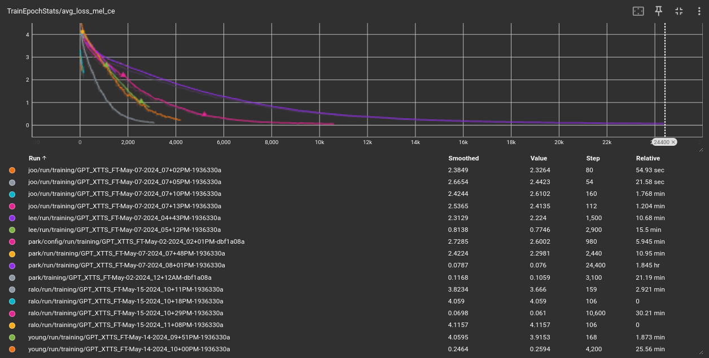
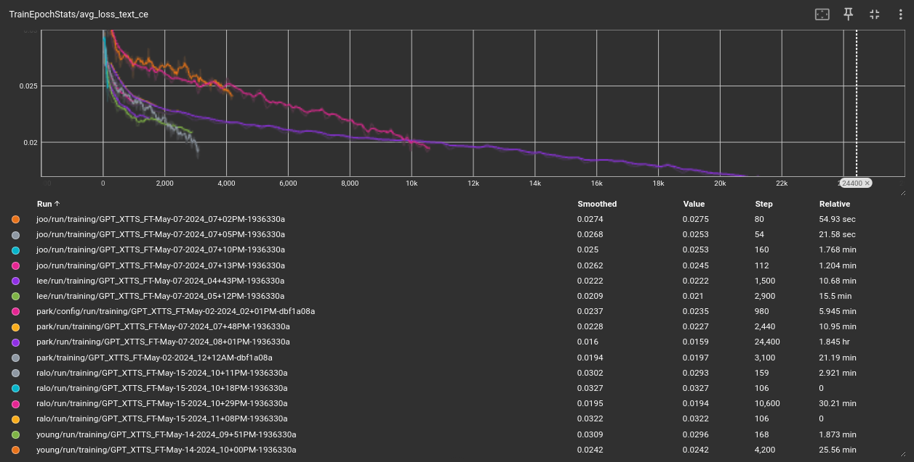
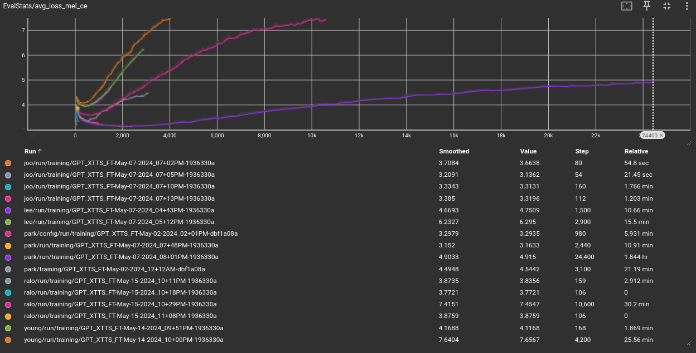
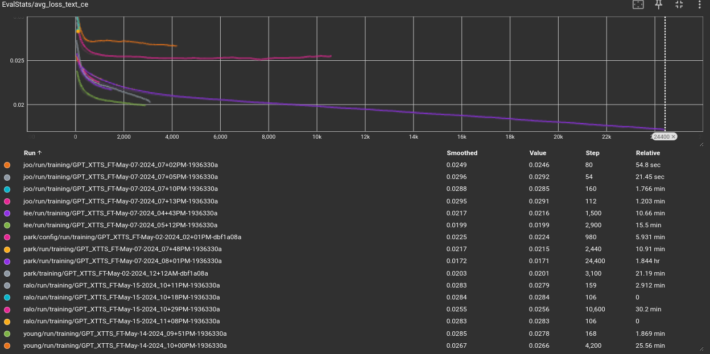

<div align="center">

# Text-to-Speech & Voice Clonning

## Table of Contents
 ### [Abstract](#abstract)
 ### [Used Model](#used-model)
 ### [Dataset](#dataset)
 ### [Training](#training)
 ### [Analysis](#analisys)
 ### [Example](#example)
 ### [Reference](#reference)


## Abstact
### 2024 캡스톤 디자인 프로젝트 팀 '아니 근데 오늘 진짜'는 사용자와 Large-Language-Model(이하 LLM)간의 음성대화를 통해 하루의 일기를 작성하는 서비스를 구현한다. 이를 위해 LLM의 Output인 Text를 Speech 즉, 음성데이터로 변환하는 기술이 필요하다. 이를 위해 Text-to-Speech 기능을 구현하였으며 추가적으로 유명인의 목소리를 합성하는 Voice Clonning 기능도 구현하였다.

## Used Model
### 사용한 모델은 [ⓍTTS](#reference)이다. 이 모델은 단 3초의 오디오 클립을 사용하여 다국어 음성을 생성할 수 있다. 24khz의 sampling rate를 지원하기 때문에 고품질의 음성을 합성할 수 있으며, Streaming Inference latency는 200ms 미만이다. 따라서 실시간성과 음성 품질을 모두 가져갈 수 있는 모델이라고 생각하여 선택하였다.

## Dataset
0. 먼저 [Install](https://docs.coqui.ai/en/dev/installation.html#installation)에 안내되어있는 방법대로 TTS Library를 설치한다.
1. Youtube에 게시되어 있는 영상을 [pytube]()을 사용하여 다운로드한 후 [pydub]()을 이용하여 .wav확장자로 저장한다.  
2. 저장된 wav file을 [pydub]()을 이용하여 일정한 단위로 분리하여 저장한다.
3. ``` python3 TTS/demos/xtts_ft_demo/xtts_demo.py ```를 입력하여 GUI에서 Dataset생성을 진행한다.

## Training
### Environment
|분류|사양|
|-|-|
|CPU|Ryzen 7700x|
|GPU|Geforce RTX 3090|
|Memory|32 GB|

### Hyper Parameter

|분류|내용|
|-|-|
Epoch|100
Batch size|4
Grad accumulation steps|1
Max permitted audio size in seconds|20

### Train Graph
### Train
<p align="center">      <figcaption align="center">

### Evaluation
<p align="center">      <figcaption align="center">

## Analisys
### Train의 loss graph는 전반적으로 우하향하지만 Evaluation mel loss graph는 잠시 하락한 후 상승하는 모습을 보인다. 데이터양의 부족함이 원인이라고 파악된다. 따라서 마지막까지 학습한 모델보다 약 400~600 step의 모델의 성능이 best model이며, 실제로 테스트해보았을때도 best model이 마지막까지 학습한 모델에 비해 더 자연스럽고 비슷하게 합성된 음성을 보여준다.

## Example
### [이상환 교수님](https://scholar.google.co.kr/citations?user=r_IjG60AAAAJ&hl=ko&oi=ao)
### 내가 그린 얼룩달룩 표범그림은 참 잘 그린 얼룩달룩 표범그림이고, 네가 그린 알룩달룩 표범그림은 참 잘 못 그린 알룩달룩 표범그림이다.
<audio controls>
    <source src='./assets/lee_ex.wav'>
</audio>

### [박하명 교수님](https://scholar.google.co.kr/citations?user=PqGNewQAAAAJ&hl=ko&oi=sra)
### 어느날 한라산 산삼이 먹고 싶다며 나를 데려간 제주도에서 저기저 돌하르방 코는 아들 날 코인가.
<audio controls>
    <source src='./assets/park_ex.wav'>
</audio>

### [래퍼 이영지](https://namu.wiki/w/%EC%9D%B4%EC%98%81%EC%A7%80)
### 앞 집 팥죽은 붉은 팥 풋팥죽이고 , 뒷집 콩죽은 햇콩단콩 콩죽,우리집 깨죽은 검은깨 깨죽인데 사람들은 햇콩 단콩 콩죽 깨죽 죽먹기를 싫어하더라.
<audio controls>
    <source src='./assets/young_ex.wav'>
</audio>

### [스트리머 랄로](https://namu.wiki/w/%EB%9E%84%EB%A1%9C)
### 불편해? 불편하면 자세를 고쳐 앉아~ 보는 자세가 잘못된 거 아니에요,,,편하게들 보세요!
<audio controls>
    <source src='./assets/ralo_ex.wav'>
</audio>

## Reference
### [ⓍTTS](https://docs.coqui.ai/en/latest/models/xtts.html)
### [이상환 교수님 데이터셋 출처](https://www.youtube.com/@user-gu2kp3dx5h)
### [박하명 교수님 데이터셋 출처](https://www.youtube.com/watch?v=0WEHB5X4bY0&t=106s)
### [래퍼 이영지 데이터셋1 출처](https://www.youtube.com/watch?v=97w6Sojb_Sw&t=8s)
### [래퍼 이영지 데이터셋2 출처](https://www.youtube.com/watch?v=TQtHNFv4uyI&t=31s)
### [스트리머 랄로 데이터셋 출처](https://www.youtube.com/watch?v=QfdXgZoyHl8&t=1276s)
</div>